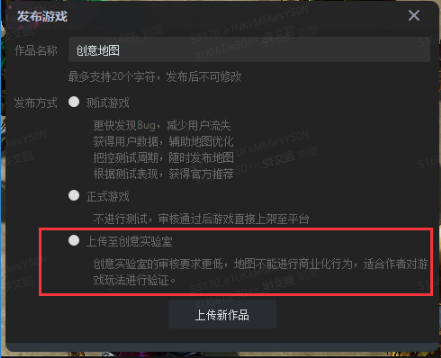
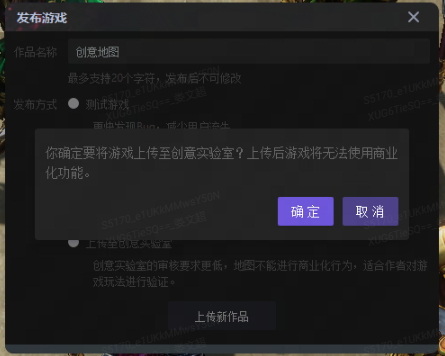
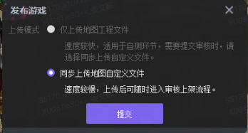
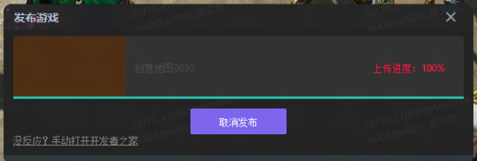
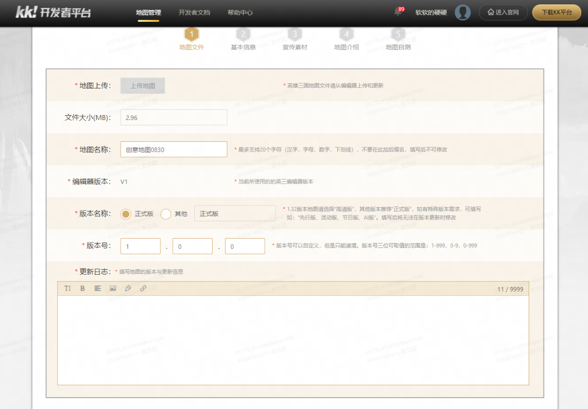

通过Y3编辑器可以快捷的将作品上传到创意实验室，创意实验室审核要求较低，但是不能进行商业道具的售卖，适合一些玩法上进行创新尝试的作品进行验证。
# 上传流程
1.Y3编辑器内点击发布-【上传地图】，选择【上传至创意实验室】

2.此时会弹出确认弹窗，避免你误操作啦~ 因为创意实验室的游戏无法出售商城道具，
主要展示创意和玩法，没问题的话就点击确认

3.上面的那个选项是用于自测的，此时我们选择[同步上传地图自定义文件]，

4.等待上传文件

5.进行游戏信息配置，这一步需要配置平台上展示的更多内容，如版本号，地图名，更新日志，说明，封面图等。

6.提交完成等待审核，【商城】的功能将会被隐藏，无法使用，审核通过后就会上架创意实验室了