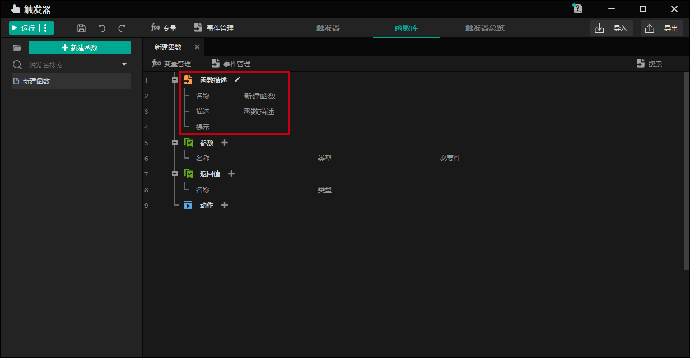
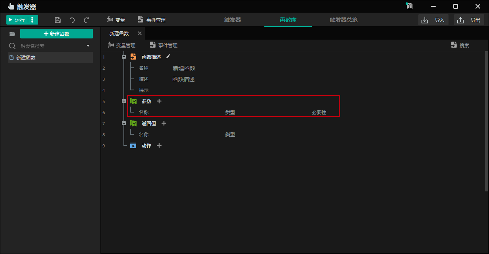
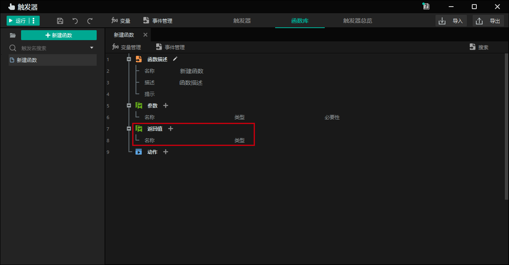
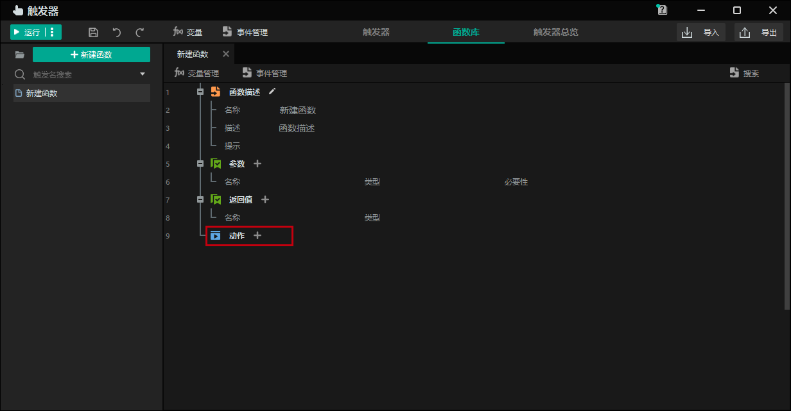
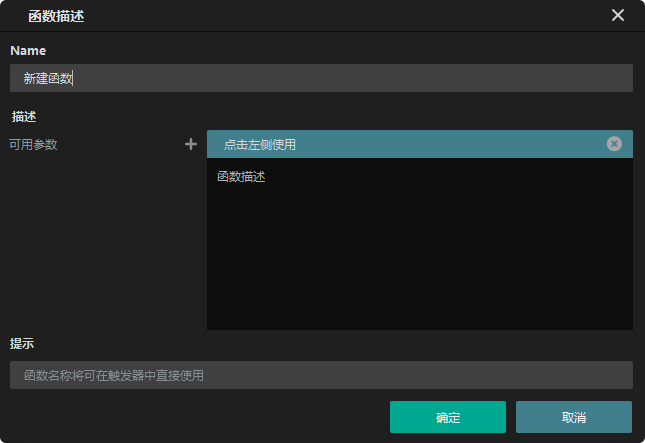
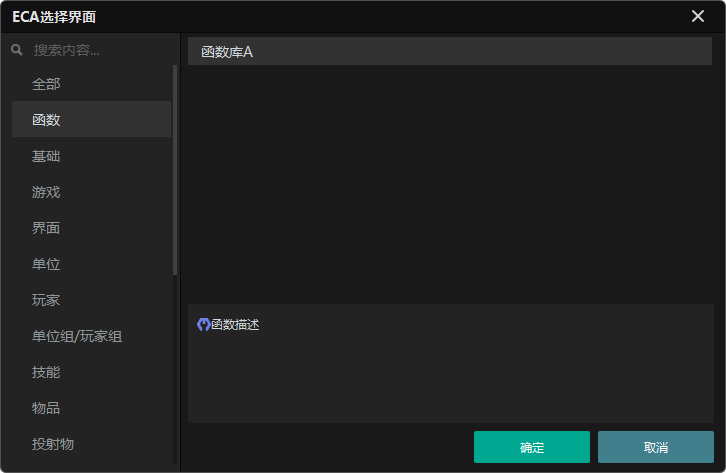

import { Callout } from 'codesandbox-theme-docs'
import { FCollapse } from 'components/FCollapse'

# 函数库

之前，我们初步学习了[触发器 - 函数库](../../guides//Navigation/Trigger#函数库)。以下简要介绍如何使用函数库。

## 添加函数

您可以将常用的触发器语句转换为函数库中的函数进行重用。将功能模块添加到**函数库**中后，您可以在触发器中找到函数语句，并直接使用它。函数库的操作逻辑与触发器相同。在左侧创建函数后，您可以在右侧编辑其内容。

## 函数描述

**函数描述**定义了函数在操作列表中的显示方式。 
函数描述包括以下内容：

**名称**：要生成的触发器语句的名称。

**说明**：要生成的触发器语句的内容和格式。

**注意事项**：当前函数的说明。

在上图所示的窗口中，双击**功能描述**或单击铅笔图标，即可进入下图所示的窗口，设置该功能。点击**可用参数**来设置参数类型，如**定时器**、**单位**和**整数**。

## 参数

**参数**语句定义了该函数在执行时必备或者可选的输入数据。

##返回值

**返回值**表示一个动作执行后返回的结果。例如，如果你在**动作中设置A+B，并在**参数中设获取到A为1，B为1，则**返回值**为2。

你可以点击 "+"来设置返回值的**名称**和**类型**，以方便触发器的后续调用。

## 动作

**动作**语句列出了函数的动作，显示了函数的具体逻辑。修改**动作**的方法与编写触发器的方法相同。

## 调用函数库

当你通过选择一个函数在触发器中添加一个动作时，你可以在**函数**标签中看到**函数库**中的所有函数。选择一个所需的函数后，动作直接生效，函数的**参数**使用变量进行填充，需要指定对应的变量进行传参。

