import { Callout } from 'codesandbox-theme-docs'
import { FCollapse } from 'components/FCollapse'

# 触发器的多层结构

一些复杂的游戏逻辑需要通过复杂的触发器语句来实现，例如复杂条件判断和循环。

## 子触发器

在解释子触发器之前，需要先解释一下触发器，触发器具有一个事件，这个事件是通过一个**注册**来实现的，总之，对一个事件进行注册，从而让系统在对应的事件触发时能继续按照条件与动作顺序执行，所有的全局触发器都是在游戏初始化时就注册完成，那么怎么在游戏内对新的事件进行**注册**呢，那就是使用**子触发器**功能来实现。

您可以在触发器的“动作”中创建一个**子触发器**。当项目逻辑运行到子触发器位置时，会新建一个触发器，并把这个触发器事件进行注册，它和全局触发器的区别在于，我们可以返回这个触发器实例，它是一种**变量类型**，以方便我们在使用完毕以后销毁它，另外，子触发器因为是游戏进程中注册，所以我们可以把变量中的数据传递给子触发器进行注册。

子触发器在注册以后就会独立运行，即按照正常触发器的**事件**和**条件**，然后运行子触发器的**动作**。运行完子触发器后，您可以对当前的子触发器进行动态销毁（如果您有需要的话）。

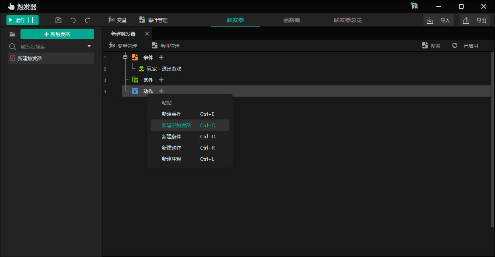

运行**子触发器**后，单位将移动到相应的点。

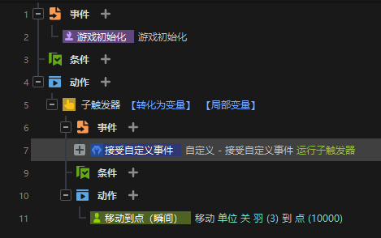

## 子触发器的变量作用域

**全局变量**可以在任何触发器及其子触发器的范围内有效。**局部变量**可以在当前触发器及其子触发器的范围内有效。**子触发器局部变量**只能在当前子触发器的范围内有效。

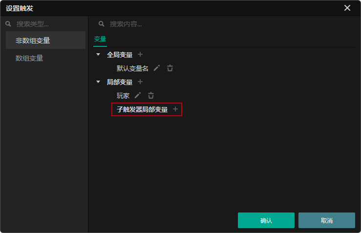

如果变量B在子触发器内声明，则可以在子触发器内使用B，不能在子触发器外使用。

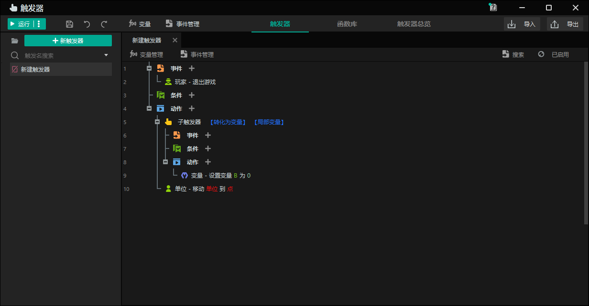

## 处理语句 - 复合条件

您可以使用复合条件语句来执行复杂的逻辑。

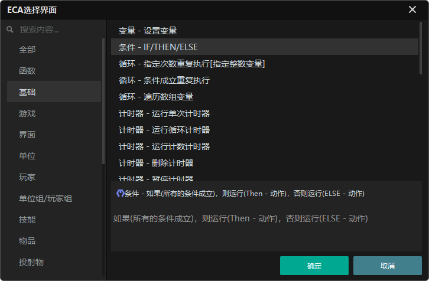
- 设置只有所有条件都满足时才能执行一个动作。

下面的语句表示如果A等于1 **并且** B等于1，则**单位**会移动到指定的**点**，其中A和B是整数类型的局部变量。

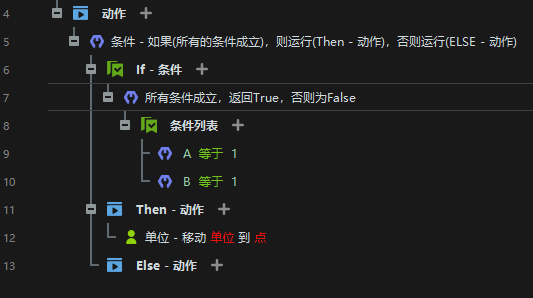

- 设置只要任何一个条件满足就执行一个动作。

下面的语句表示如果整数A等于1 **或者** 整数B等于1，则**单位**会移动到指定的**点**。

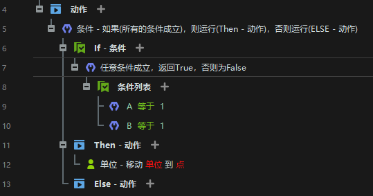

- 设置只有当条件都不满足时才执行一个动作。

下面的语句表示如果整数A **不等于** 1 **并且** 整数B **不等于** 1，则**单位**会移动到指定的**点**。

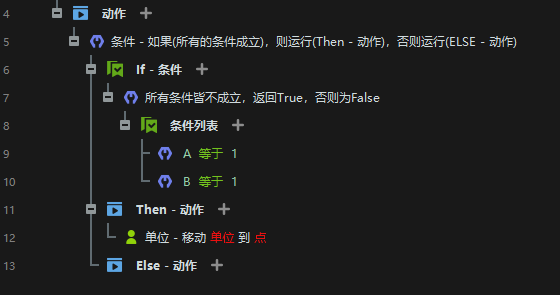

- 设置满足条件时触发事件A，不满足条件时触发事件B。

下面的语句表示如果A等于1，则**单位**会移动到指定的**点A**；否则，**单位**会移动到指定的**点B**。

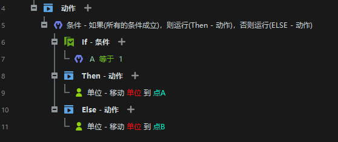

## 循环

您可以使用**循环**来使一组触发语句重复运行。

- **执行指定次数的动作**

一个动作被重复执行，次数由**指定的整数变量**确定。

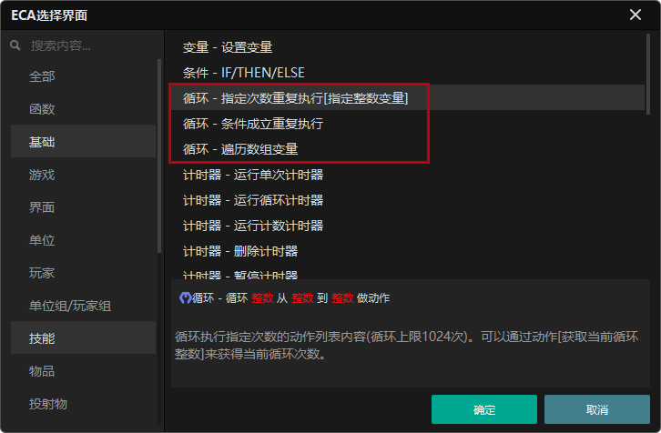

例如，下面的语句表示在**点A**创建三个属于**玩家1**的**关羽**单位，朝向为180度，其中**点A**是一个**点**类型的局部变量。

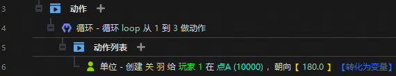

- **当条件满足时重复执行动作**

循环无限次，直到满足设置条件为止。

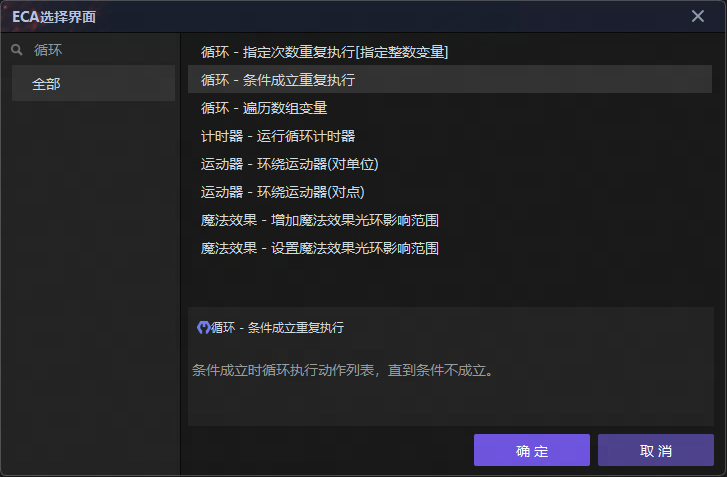

例如，下面的语句表示如果A等于1，则在**点A**创建一个朝向为**180度**的属于**玩家1**的**关羽**单位。

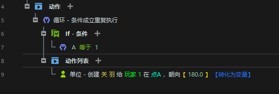

## 计时器

计时器可用于处理与时间相关的游戏逻辑。

- **单次计时器**

计时器运行一次后执行动作。

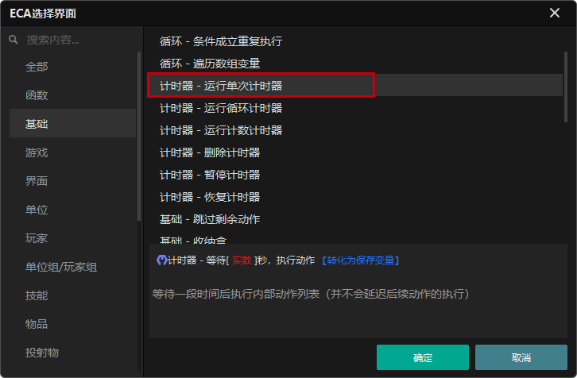

例如，下面的语句表示在3秒后将**单位**移动到**点A**，其中**点A**是一个**point**类型的局部变量。

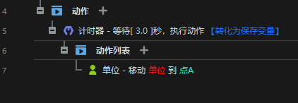

- **运行循环计时器**

计时器循环运行，每次运行后都会执行动作。

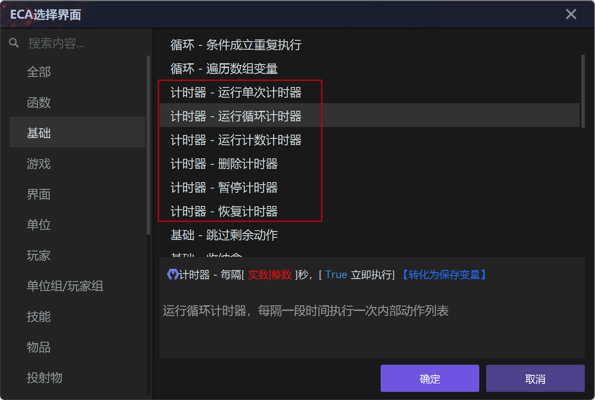

例如，下面的语句表明，**单位**每3秒移动到**点A**。

<Callout type="info"> 
注意：你可以选择**True**并立即执行动作（如下图所示），或者选择**False**并在3秒后执行第一个动作。
</Callout>

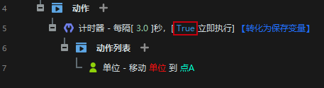

- **运行计数计时器**

一个计时器，在运行过程中每固定时间运行一次，总计运行固定次数。

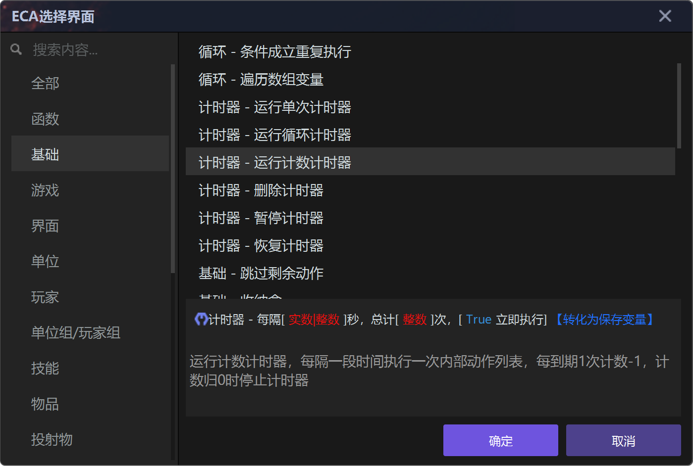

例如，下面的语句表明，**单位**每3秒移动到**点A**，Action总共立即执行3次。

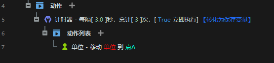

## 单位组

一个**单位组**是一个或多个单位的集合，保留了单位的操作方式。你可以直接对一个单位组进行重复操作。

- **在单位组中挑选单位来执行操作**

对一个单位组中的每个单位执行一个操作。

## 单位组

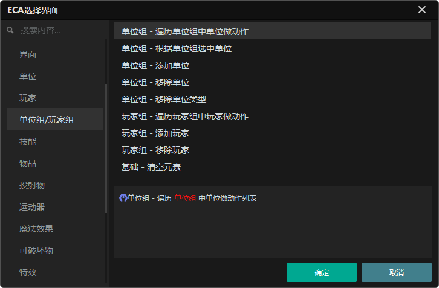

**单位组**是一个包含一个或多个单位的集合，用于控制单位的操作。您可以直接对一个单位组执行重复操作。

- **选择单位组中的单位执行动作**

为单位组中的每个单位执行一个动作。

例如，下面的语句表示在**单位组AA**中的**点A**处复活所有**单位**，其中**AA**是**单位组**的一个局部变量，**A**是**点**的一个局部变量。

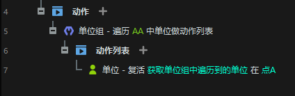

## 玩家组

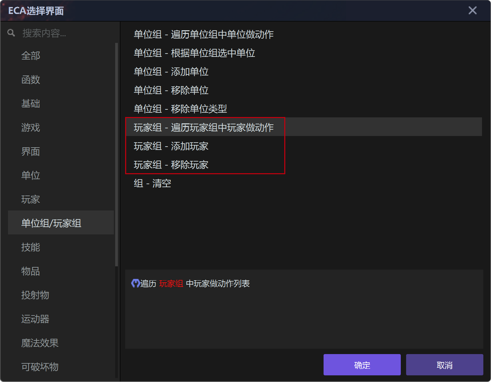

**玩家组**是一个包含一个或多个玩家的集合。您可以直接对玩家组中的所有玩家执行操作。

- 选择玩家组中的玩家执行动作

设置的操作将对玩家组中的所有玩家生效。

例如，下面的语句表示在**点A**创建一个**关羽**单位，并将该单位分配给**玩家组BB**中的每个玩家，单位面向180°角度，其中**BB**是**玩家组**的一个局部变量，**A**是**点**的一个局部变量。

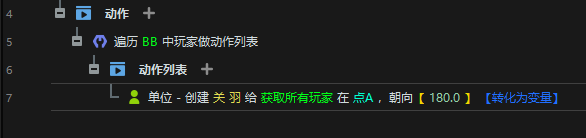

## 运动器

运动器可为单位或特效添加运动效果，例如沿直线移动和跟踪单位。它是创建能力和特效的常见函数。

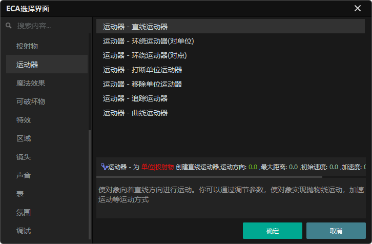

您可以设置运动器的 **方向、距离、初始速度**和**加速度**。您也可以在运动器操作期间通过触发器实现这些效果。

**方向**：线性运动器的运动方向。

**距离**：运动器效果的最大距离。

**初始速度**：释放运动器时的初始速度。

**加速度**：释放运动器后的加速度。

**可选参数**：单击 **【可选参数】** 设置其他参数。

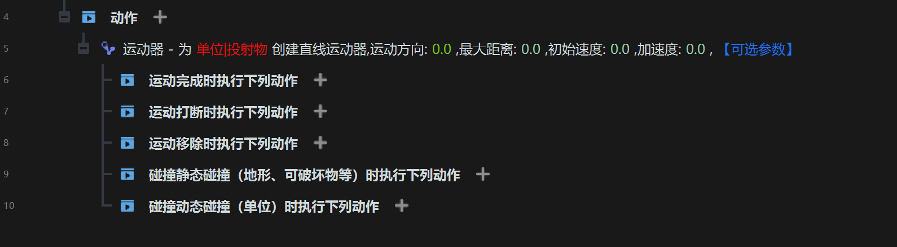

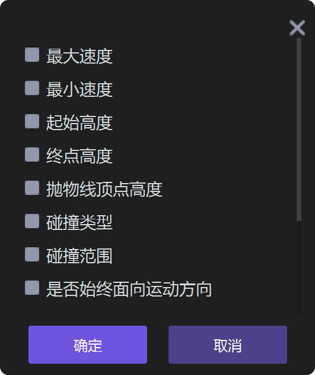

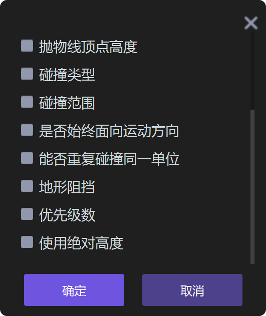
