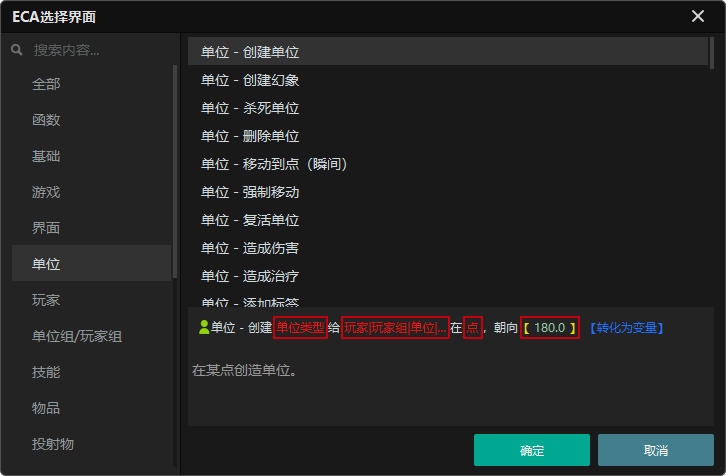
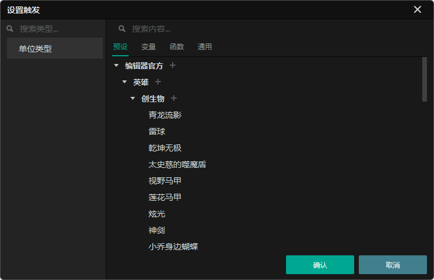
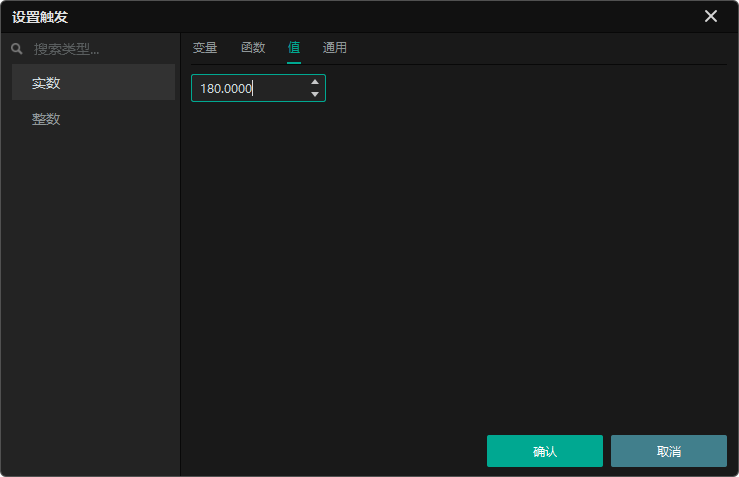
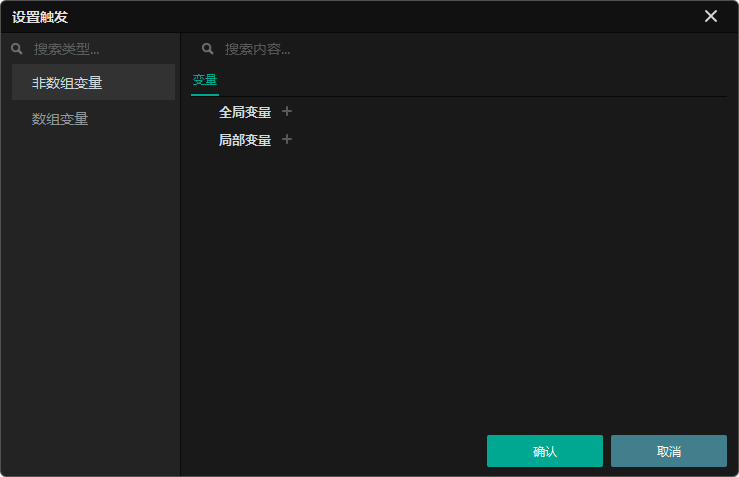
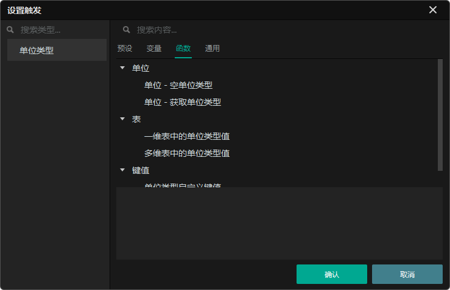
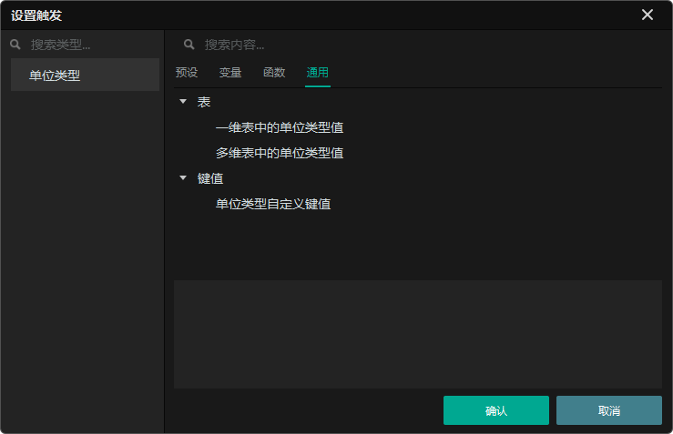
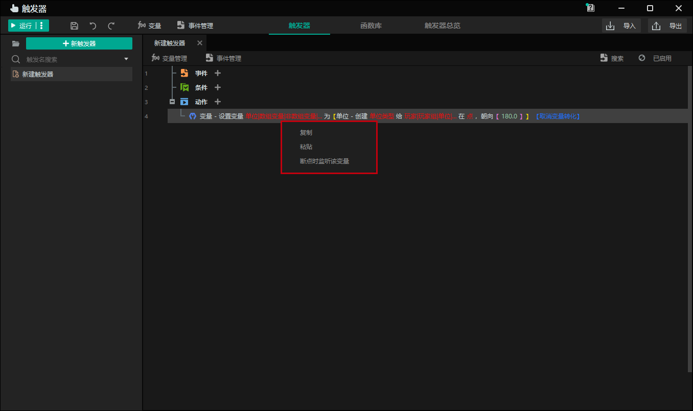
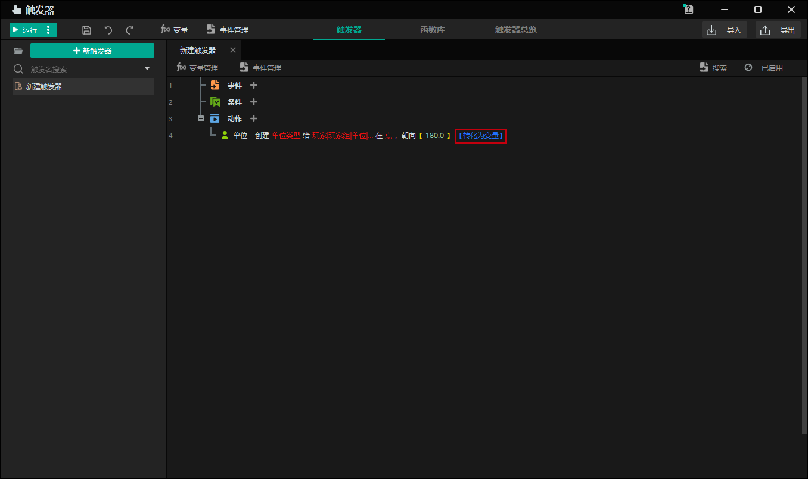
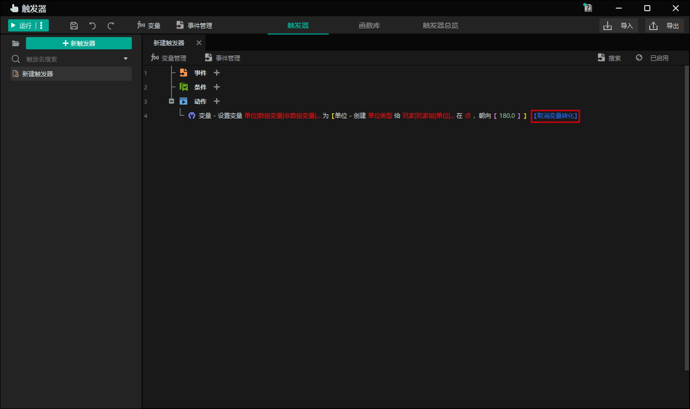

import { Callout } from 'codesandbox-theme-docs'
import { FCollapse } from 'components/FCollapse'

# 参数设置

参数是需要开发者在触发器动作中进行赋值的内容。有些参数是必须的，可选的参数则在次级菜单中选用。未赋值的参数会以红色显示，已赋值的参数会以填入的数据类型分配颜色，额外的选项会以蓝色显示。文本信息说明了当前触发器语句的含义。需要注意的是，需要指定所有的参数，本条动作以及所在的触发器才能正常运行。

## 赋值类型

如果你想为改变参数，可以点击目标参数以跳转到编辑页面。基于参数类型，编辑器为参数提供了四种赋值类型：**预设/数值**，**变量**，**函数** 和 **通用**。

- **预设**：当参数类型为可以放置在场景中的对象时，例如 **单位**，**装饰**，**物体**，**特效** 和 **可破坏物**，可以直接选择预设对象作为参数。

- **数值**：你可以直接将一个固定的数字、文本或布尔值（该值只能为True或False）赋给一个参数。该值对于整数、实数、字符串和布尔值类型的参数有效。

- **变量**：用于存储或记录值、参数和结果。

- **函数**：函数是一组官方打包的获取数据的动作，可以直接提供对应的返回值。函数语句可以简单理解为具备返回值的触发器。因此，许多函数语句需要指定参数才能正常执行。

- **通用**：用于设置 **自定义值** 和调用[表格编辑器](../Navigation/Table_Editor#table-editor)。

## 参数重用和变量转换

右键单击参数或【】以外的区域可以**复制**或**粘贴**参数。当您选择**复制**时，整个参数的值和类型都将被复制到剪贴板上，以便开发人员可以将它们粘贴到相同类型的其他参数中。

当您单击**转换为变量**时，会在当前语句之前创建一个变量赋值语句。您可以创建一个变量，并使用该动作对变量进行赋值。

转换为变量后，您可以单击**取消变量转换**以恢复到之前的状态。

