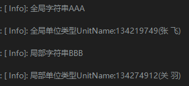
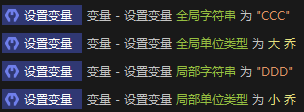
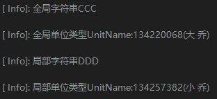
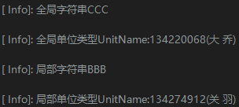
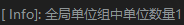
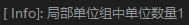
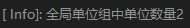
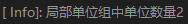
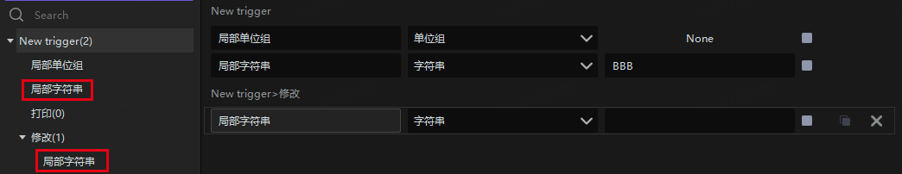
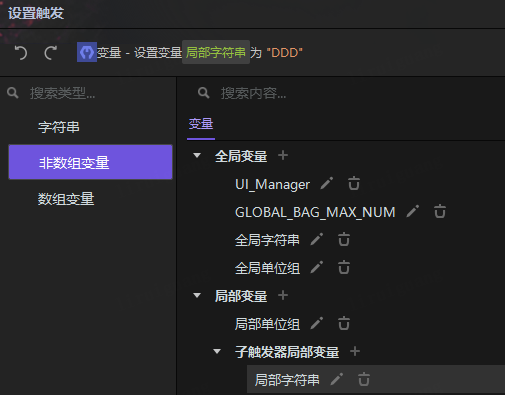

import { Callout } from 'codesandbox-theme-docs'
import { FCollapse } from 'components/FCollapse'

# 触发器变量作用域

作用域是指在程序中定义变量时，该变量所能被访问到的范围。作用域规定了变量的可见性和生命周期。

作用域的一个重要概念是变量的隐藏。当在局部作用域中定义一个与全局作用域中同名的变量时，局部作用域中的变量会“隐藏”全局作用域中的变量。这意味着在局部作用域内部，访问该变量时会使用局部作用域中的值，而不是全局作用域中的值。只有离开局部作用域后，才能再次访问到全局作用域中的变量。

作用域的存在可以确保变量的命名不会冲突，并且提供了一定程度的封装和隔离性，使得程序更加可靠和可维护。
# 变量在触发器中的类型
以作用域来划分：
全局变量
函数局部变量
触发局部变量
子触发器局部变量
组变量
【项目变量】：之后随着项目级触发器功能引入项目级作用域
以类型来划分：
对象型变量
单位、单位组、玩家组、单位命令
非对象类型
字符串、实数、整数、布尔值
# 变量作用域演示1
此次变量使用以下4种变量

全局字符串

全局单位类型

局部字符串

局部单位类型

1. 首先打印每个类型的初始值

2.其次通过子触发器修改这4个变量的值并打印

3.通过另一个子触发器来打印修改是否应用到全局

# 变量作用域演示2
此次变量使用以下2种变量
全局单位组

局部单位组

1.首先打印每个类型的初始值

2.其次通过子触发器给单位组各自增加单位数量并打印

3.通过其他子触发器打印单位组数量.

# 变量作用域总结
子触发器内部对于赋值运算只会在子触发器内部生效，不会影响外部

对象型变量如：单位组、玩家组等，对单位组进行操作会同步影响到外部，对单位的单位属性修改也是同理

【后期版本若出现局部变量与子触发器变量重名情况，则子触发器只能引用到内部的同名变量】

其中可以看到局部变量与子触发器内部都有同名变量：局部字符串
但当子触发器内部想修改外部同名变量时是无法选中的