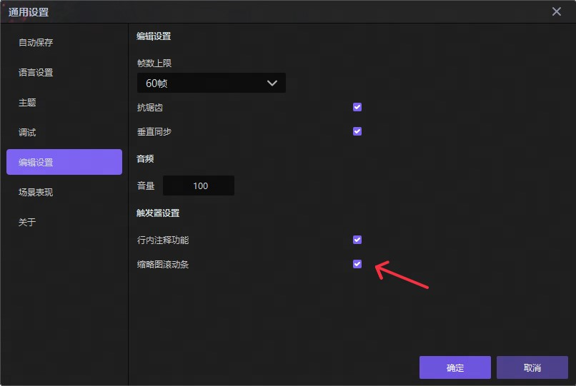
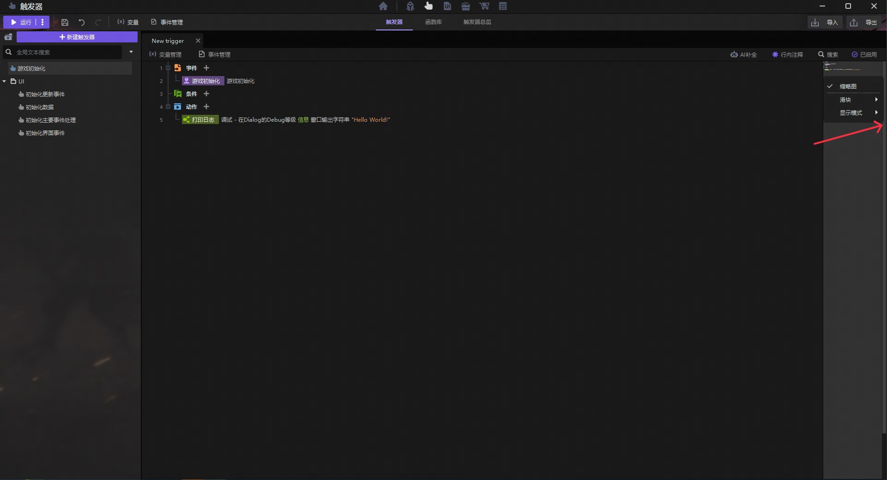
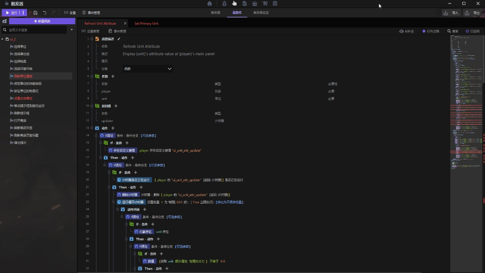

import { Callout } from 'codesandbox-theme-docs'
import { FCollapse } from 'components/FCollapse'

# 功能入口
1.在“主界面-编辑-通用设置-编辑设置”中勾选“缩略图滚动条”。

2.来到触发器编辑界面，选择任意触发器文件，可以看到右侧滚动条右键菜单中的ECA缩略图，并且可以通过右键点击来进行一些设置更改。

# 使用说明
可以长按左键拖动右侧缩略图或直接左键点击定位到想要的行数。

缩略图也可以收起，错误、点选与搜索结果也会以色块形式显示到普通滚动条上，收起后需要重新在“主界面-编辑-通用设置-编辑设置”打开。

