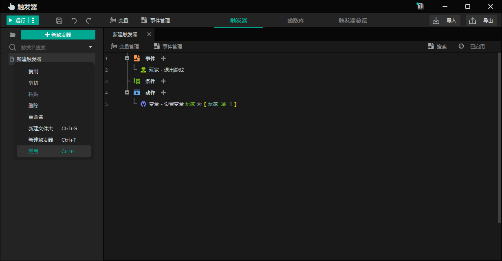
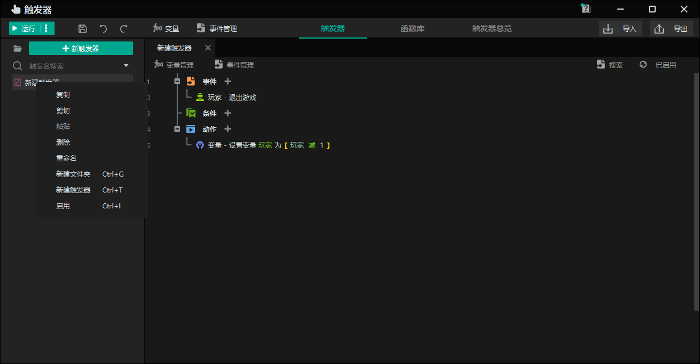
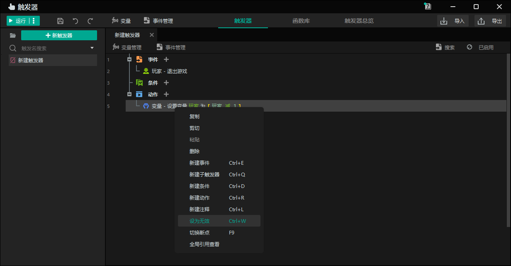
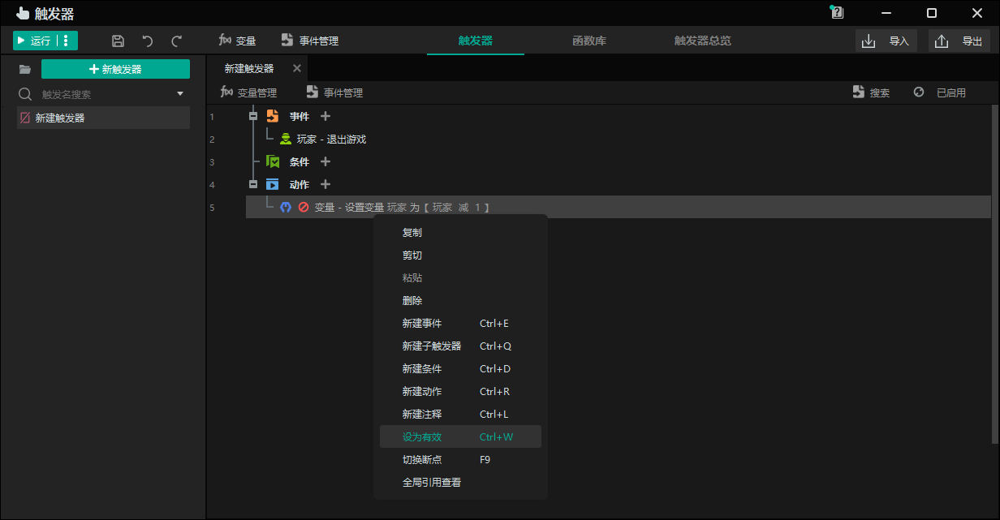

import { Callout } from 'codesandbox-theme-docs'
import { FCollapse } from 'components/FCollapse'

# 触发器的有效性

您可以使编辑的触发器无效，以便触发器不会运行。当您需要运行触发器时，可以重新激活它。无效的触发器不会影响游戏的逻辑，可以在需要时激活和调用。

右键单击触发器并选择**禁用**使其无效。单击**启用**以重新激活无效的触发器。

您可以设置触发器中语句的有效性，这样无论语句是否完成，禁用的语句都将被跳过。右键单击语句并选择**设为无效**进行禁用。同样，右键单击语句并选择**设为有效**以启用被禁用的语句。

