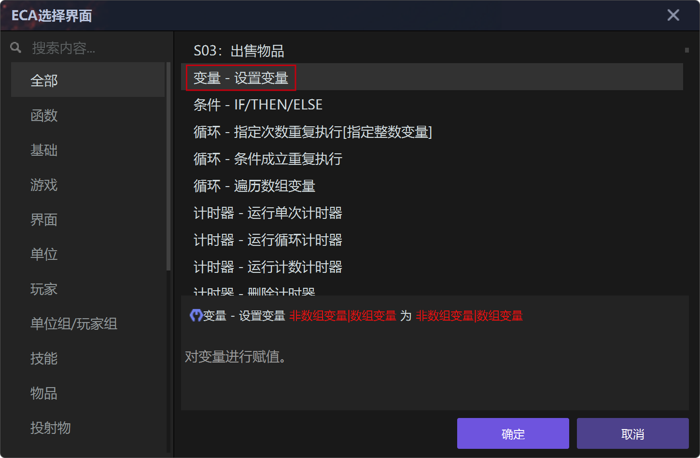
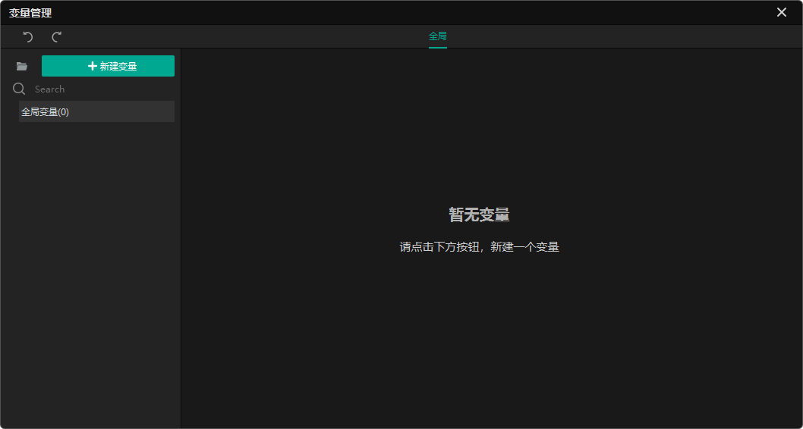
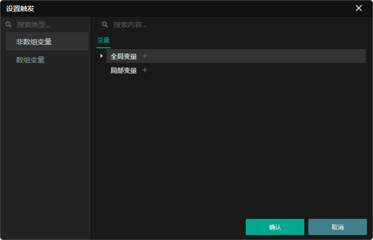
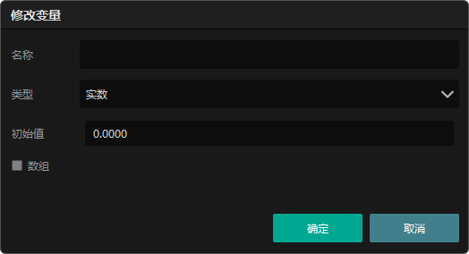
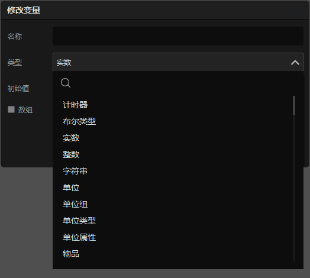
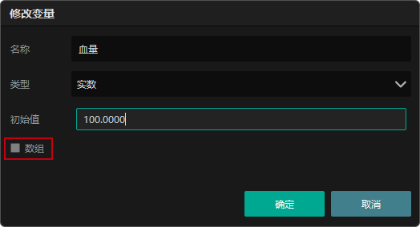
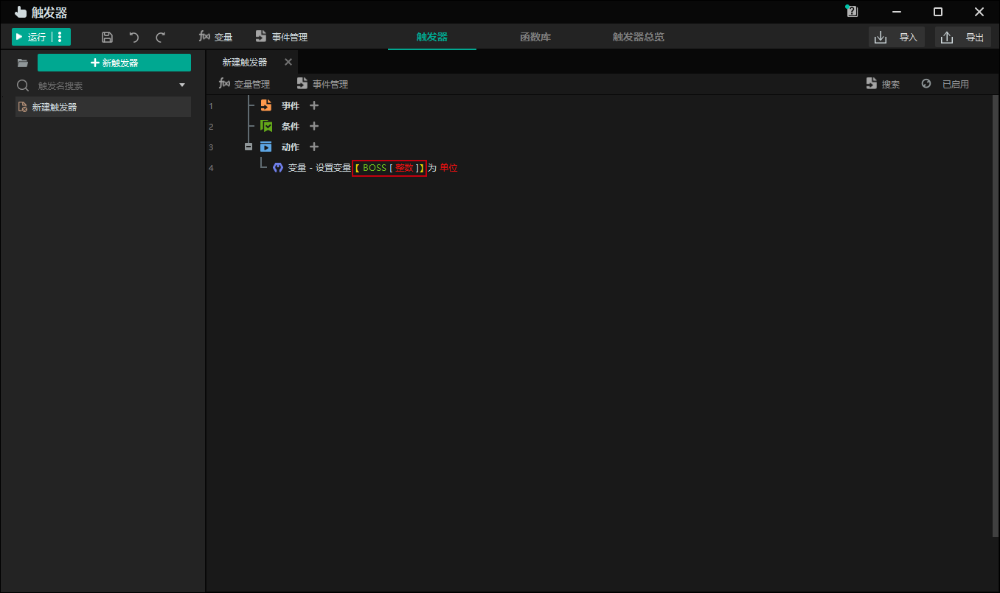
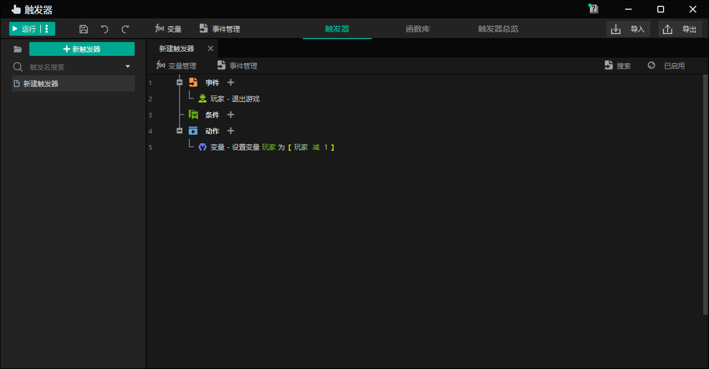

import { Callout } from 'codesandbox-theme-docs'
import { FCollapse } from 'components/FCollapse'

# 变量设置

您可以通过触发器界面[设置变量](../../guides/Navigation/Trigger#触发器的界面)或通过ECA选择界面设置变量。

## 变量的范围

变量根据作用域类型分为**全局变量**和**局部变量**。

**全局变量**可以在本项目内的任何触发器中读取和写入。

**局部变量**只能在当前触发器中生效。

## 变量的属性

您可以设置和命名各种类型的变量以便于后续调用。部分变量类型必须设置**默认值**。

变量的**类型**包括**整数**、**浮点数**和**单位**。

您可以设置变量的**默认值**。赋值后将覆盖默认值。

**数组**是数据的集合，集合内的变量名字是数组名称，数组变量的呈现形式为名称[标号]，如单位数组变量Boss[1], Boss[2]。

## 变量的特性

变量只能用于储存数据的媒介，并不会实时更新，任何对变量的操作都需要使用赋值动作进行实现。请不要忘记在触发器中编写更新变量的语句。

例如，在游戏运行的时候设置变量“玩家人数”为6，5分钟后有一位玩家退出游戏，此时游戏中玩家人数为5，如果没有编写变量更新语句，那么变量“玩家人数”依然为6。你需要编写能表达“在玩家退出游戏的时候玩家人数减1”的逻辑。

